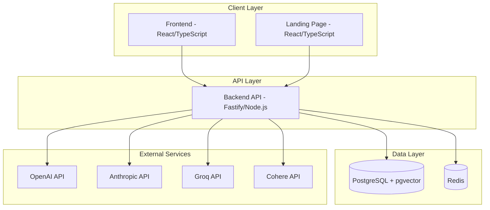

# JoaLLM Platform - System Architecture

## Overview

JoaLLM is a production-grade LLM platform built with a microservices-ready architecture currently deployed as a monolithic MVP with three core services.

## Architecture Diagram



## Core Components

### 1. Frontend (`services/frontend`)
- **Technology**: React 18 + TypeScript + Vite
- **Features**:
  - Chat interface with multiple LLM providers
  - RAG search and document management
  - Workflow builder
  - Notebook interface
  - Real-time updates

### 2. Landing Page (`services/landing-page`)
- **Technology**: React 18 + TypeScript + Vite
- **Features**:
  - Marketing content
  - User authentication
  - Product showcase

### 3. Backend API (`services/backend`)
- **Technology**: Fastify + TypeScript + Node.js
- **Features**:
  - RESTful API with OpenAPI documentation
  - JWT authentication with encryption
  - Multi-provider LLM integration
  - RAG with pgvector
  - Document processing pipeline
  - BullMQ job queues

### 4. Database (PostgreSQL + pgvector)
- **Purpose**: Primary data store with vector search
- **Key Tables**:
  - `users`: User accounts with encrypted API keys
  - `chat_sessions`: Chat history
  - `files`: Uploaded documents
  - `document_chunks`: Text chunks with embeddings
  - `rag_search_sessions`: Search history

### 5. Cache/Queue (Redis)
- **Purpose**: Caching and job queue management
- **Uses**:
  - Session storage
  - Query result caching
  - Document processing queues
  - Rate limiting

## Security Architecture

### Authentication Flow
1. User registers/logs in
2. Backend generates JWT token (7-day expiry)
3. Token includes user ID, email, role
4. All protected endpoints verify JWT

### API Key Management
- User API keys encrypted at rest (AES-256-GCM)
- Encryption key stored in environment variables
- Keys decrypted only when needed for LLM calls
- Never logged in plaintext

### Security Layers
1. HTTPS enforcement (production)
2. Helmet security headers
3. CORS with origin validation
4. Rate limiting per endpoint
5. Input sanitization
6. SQL injection protection (Drizzle ORM)

## Data Flow

### Chat Request Flow
```
1. User sends message → Frontend
2. Frontend → Backend API (/api/chat/send)
3. Backend fetches user API keys (decrypted)
4. Backend calls LLM provider
5. Stream response back to frontend
6. Save message to database
```

### RAG Search Flow
```
1. User uploads document → Frontend
2. Frontend → Backend API (/api/files/upload)
3. Backend saves file metadata
4. Background job: Extract text
5. Background job: Generate embeddings (Cohere)
6. Store chunks with embeddings in database
7. User searches → Vector similarity search
8. Return relevant chunks with scores
```

## Deployment Architecture (Railway)

```
Backend Service (Node.js)
├── Port: 3001
├── Health Check: /api/health
└── Environment: PostgreSQL + Redis provided

Frontend Service (Static)
├── Port: 5174
├── Built with Vite
└── Served with serve

Landing Page Service (Static)
├── Port: 5175
├── Built with Vite
└── Served with serve
```

## Scalability Considerations

### Current MVP (Monolithic)
- Single backend instance
- Shared PostgreSQL and Redis
- Suitable for 1-10K users

### Future Microservices (When Needed)
- API Gateway for routing
- Separate Auth Service
- Separate Chat Service
- Message queue (RabbitMQ/Kafka)
- Horizontal scaling with load balancer

## Performance Optimizations

1. **Database**:
   - HNSW indexes for vector search
   - Composite indexes on common queries
   - Connection pooling

2. **Caching**:
   - Redis for user profiles (5 min)
   - Model lists cached (30 min)
   - RAG results cached (10 min)

3. **Frontend**:
   - Code splitting & lazy loading
   - Bundle size optimization
   - Service worker for offline support

## Monitoring & Observability

1. **Logging**: Winston + structured logging
2. **Metrics**: Prometheus + Grafana
3. **Error Tracking**: Ready for Sentry integration
4. **Health Checks**: /api/health endpoint
5. **Request Tracing**: Correlation IDs

## Technology Stack

**Backend**:
- Runtime: Node.js 18+
- Framework: Fastify 4.x
- Language: TypeScript 5.x
- ORM: Drizzle
- Validation: Zod
- Queue: BullMQ
- Testing: Vitest

**Frontend**:
- Framework: React 18
- Language: TypeScript 5.x
- Build: Vite 5.x
- State: Zustand
- Router: React Router v6
- UI: TailwindCSS
- Testing: Vitest + React Testing Library

**Infrastructure**:
- Database: PostgreSQL 15 + pgvector
- Cache: Redis 7
- Deployment: Railway
- CI/CD: GitHub Actions

## Next Steps for Production

1. ✅ Security hardening (encryption, rate limiting)
2. ✅ Comprehensive testing (80%+ coverage)
3. ✅ Performance optimization (caching, indexes)
4. ✅ Monitoring setup (error tracking, metrics)
5. 🔄 Load testing (target: 100 concurrent users)
6. 🔄 Disaster recovery plan
7. 🔄 Backup automation
8. 🔄 CDN setup for static assets


