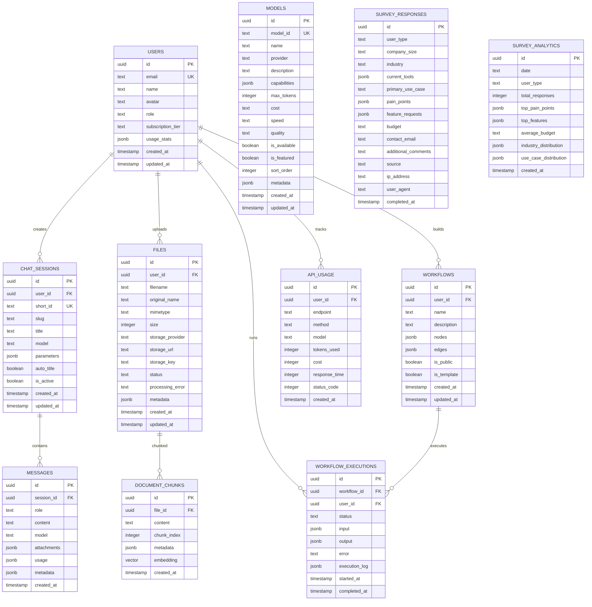

```mermaid
erDiagram
    USERS {
        uuid id PK
        text email UK
        text name
        text avatar
        text role
        text subscription_tier
        jsonb usage_stats
        timestamp created_at
        timestamp updated_at
    }

    CHAT_SESSIONS {
        uuid id PK
        uuid user_id FK
        text short_id UK
        text slug
        text title
        text model
        jsonb parameters
        boolean auto_title
        boolean is_active
        timestamp created_at
        timestamp updated_at
    }

    MESSAGES {
        uuid id PK
        uuid session_id FK
        text role
        text content
        text model
        jsonb attachments
        jsonb usage
        jsonb metadata
        timestamp created_at
    }

    FILES {
        uuid id PK
        uuid user_id FK
        text filename
        text original_name
        text mimetype
        integer size
        text storage_provider
        text storage_url
        text storage_key
        text status
        text processing_error
        jsonb metadata
        timestamp created_at
        timestamp updated_at
    }

    DOCUMENT_CHUNKS {
        uuid id PK
        uuid file_id FK
        text content
        integer chunk_index
        jsonb metadata
        vector embedding
        timestamp created_at
    }

    WORKFLOWS {
        uuid id PK
        uuid user_id FK
        text name
        text description
        jsonb nodes
        jsonb edges
        boolean is_public
        boolean is_template
        timestamp created_at
        timestamp updated_at
    }

    WORKFLOW_EXECUTIONS {
        uuid id PK
        uuid workflow_id FK
        uuid user_id FK
        text status
        jsonb input
        jsonb output
        text error
        jsonb execution_log
        timestamp started_at
        timestamp completed_at
    }

    API_USAGE {
        uuid id PK
        uuid user_id FK
        text endpoint
        text method
        text model
        integer tokens_used
        integer cost
        integer response_time
        integer status_code
        timestamp created_at
    }

    MODELS {
        uuid id PK
        text model_id UK
        text name
        text provider
        text description
        jsonb capabilities
        integer max_tokens
        text cost
        text speed
        text quality
        boolean is_available
        boolean is_featured
        integer sort_order
        jsonb metadata
        timestamp created_at
        timestamp updated_at
    }

    SURVEY_RESPONSES {
        uuid id PK
        text user_type
        text company_size
        text industry
        jsonb current_tools
        text primary_use_case
        jsonb pain_points
        jsonb feature_requests
        text budget
        text contact_email
        text additional_comments
        text source
        text ip_address
        text user_agent
        timestamp completed_at
    }

    SURVEY_ANALYTICS {
        uuid id PK
        text date
        text user_type
        integer total_responses
        jsonb top_pain_points
        jsonb top_features
        text average_budget
        jsonb industry_distribution
        jsonb use_case_distribution
        timestamp created_at
    }

    USERS ||--o{ CHAT_SESSIONS : "creates"
    USERS ||--o{ FILES : "uploads"
    USERS ||--o{ WORKFLOWS : "builds"
    USERS ||--o{ WORKFLOW_EXECUTIONS : "runs"
    USERS ||--o{ API_USAGE : "tracks"

    CHAT_SESSIONS ||--o{ MESSAGES : "contains"

    FILES ||--o{ DOCUMENT_CHUNKS : "chunked"

    WORKFLOWS ||--o{ WORKFLOW_EXECUTIONS : "executes"
```
