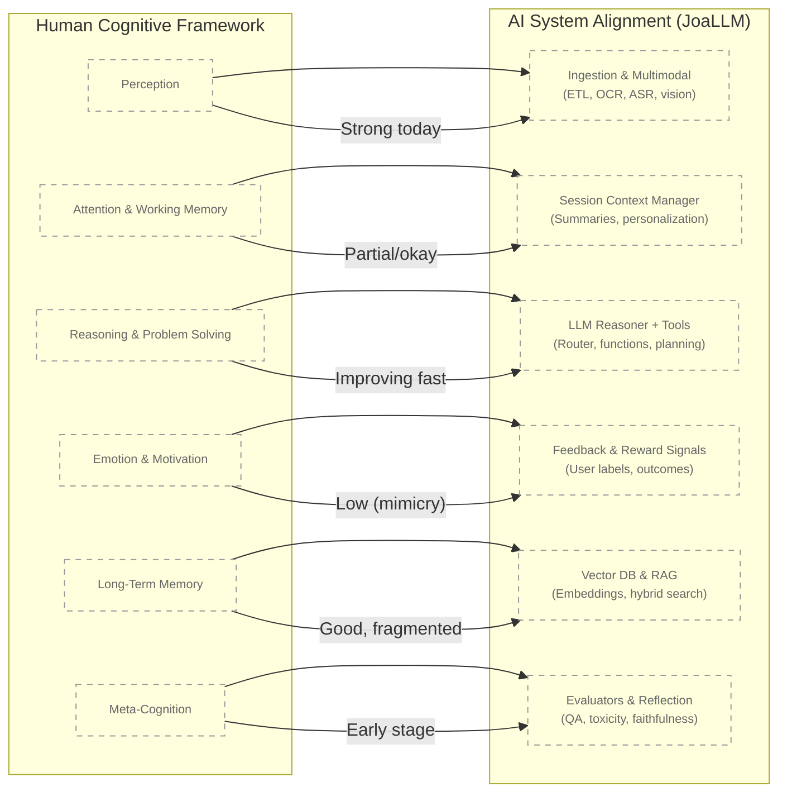
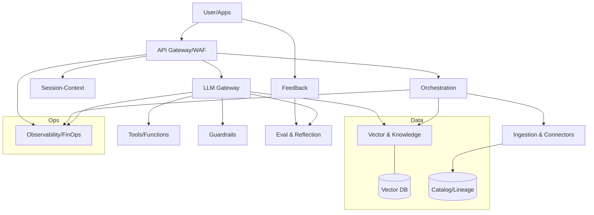
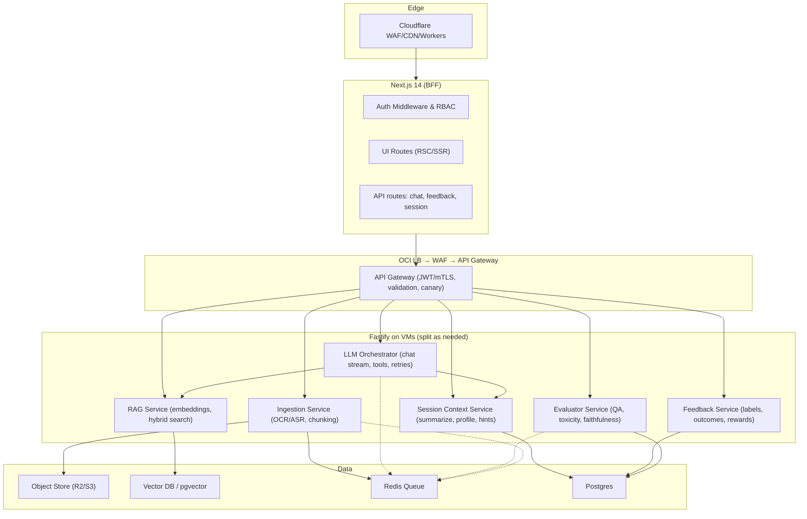

```mermaid
graph LR
  %% Left: Human Cognitive Framework
  subgraph HCF["Human Cognitive Framework"]
    PER["Perception"]
    ATT["Attention & Working Memory"]
    REA["Reasoning & Problem Solving"]
    EMO["Emotion & Motivation"]
    LTM["Long-Term Memory"]
    META["Meta-Cognition"]
  end

  %% Right: AI System Components
  subgraph AI["AI System Alignment (JoaLLM)"]
    ING["Ingestion & Multimodal\n(ETL, OCR, ASR, vision)"]
    CTX["Session Context Manager\n(Summaries, personalization)"]
    LLM["LLM Reasoner + Tools\n(Router, functions, planning)"]
    RWD["Feedback & Reward Signals\n(User labels, outcomes)"]
    VEC["Vector DB & RAG\n(Embeddings, hybrid search)"]
    EVAL["Evaluators & Reflection\n(QA, toxicity, faithfulness)"]
  end

  %% Mappings
  PER  --> ING
  ATT  --> CTX
  REA  --> LLM
  EMO  --> RWD
  LTM  --> VEC
  META --> EVAL

  %% Optional overlays (not nodes): Safety/Governance & Observability
  classDef overlay fill:#ffffff00,stroke:#999,stroke-dasharray: 5 5,color:#666,font-size:11px;
  class PER,ATT,REA,EMO,LTM,META overlay;
  class ING,CTX,LLM,RWD,VEC,EVAL overlay;

  %% Maturity annotations (labels on edges)
  PER-- "Strong today" -->ING
  ATT-- "Partial/okay" -->CTX
  REA-- "Improving fast" -->LLM
  EMO-- "Low (mimicry)" -->RWD
  LTM-- "Good, fragmented" -->VEC
  META-- "Early stage" -->EVAL

```

```mermaid
graph TB
  U[User/Apps] --> G[API Gateway/WAF]
  G --> R[LLM Gateway]
  G --> S[Session-Context]
  G --> O[Orchestration]
  O --> I[Ingestion & Connectors]
  O --> K[Vector & Knowledge]
  R --> K
  R --> T[Tools/Functions]
  R --> GR[Guardrails]
  R --> EV[Eval & Reflection]
  U --> FB[Feedback]
  FB --> EV
  subgraph Data
    K --- DB[(Vector DB)]
    CAT[(Catalog/Lineage)]
  end
  subgraph Ops
    OBS[Observability/FinOps]
  end
  R --> OBS
  O --> OBS
  G --> OBS
  I --> CAT
```

```mermaid
graph TB
  subgraph Edge
    CF["Cloudflare WAF/CDN/Workers"]
  end

  subgraph App_Next["Next.js 14 (BFF)"]
    AUTH["Auth Middleware & RBAC"]
    UI["UI Routes (RSC/SSR)"]
    BFF["API routes: chat, feedback, session"]
  end

  subgraph API_Tier["OCI LB → WAF → API Gateway"]
    GW["API Gateway (JWT/mTLS, validation, canary)"]
  end

  subgraph Services["Fastify on VMs (split as needed)"]
    ORCH["LLM Orchestrator (chat stream, tools, retries)"]
    SESS["Session Context Service (summarize, profile, hints)"]
    ING["Ingestion Service (OCR/ASR, chunking)"]
    RAG["RAG Service (embeddings, hybrid search)"]
    EVAL["Evaluator Service (QA, toxicity, faithfulness)"]
    FBK["Feedback Service (labels, outcomes, rewards)"]
  end

  subgraph Data
    OBJ["Object Store (R2/S3)"]
    VDB["Vector DB / pgvector"]
    RQ["Redis Queue"]
    PSQL["Postgres"]
  end

  CF --> App_Next
  App_Next --> GW
  GW --> ORCH
  GW --> SESS
  GW --> ING
  GW --> RAG
  GW --> EVAL
  GW --> FBK

  ING --> OBJ
  ING --> RQ
  RAG --> VDB
  SESS --> PSQL
  FBK --> PSQL
  ORCH --> RAG
  ORCH --> SESS
  EVAL --> PSQL

  ORCH -.-> RQ
  EVAL -.-> RQ
  ING -.-> RQ


```
