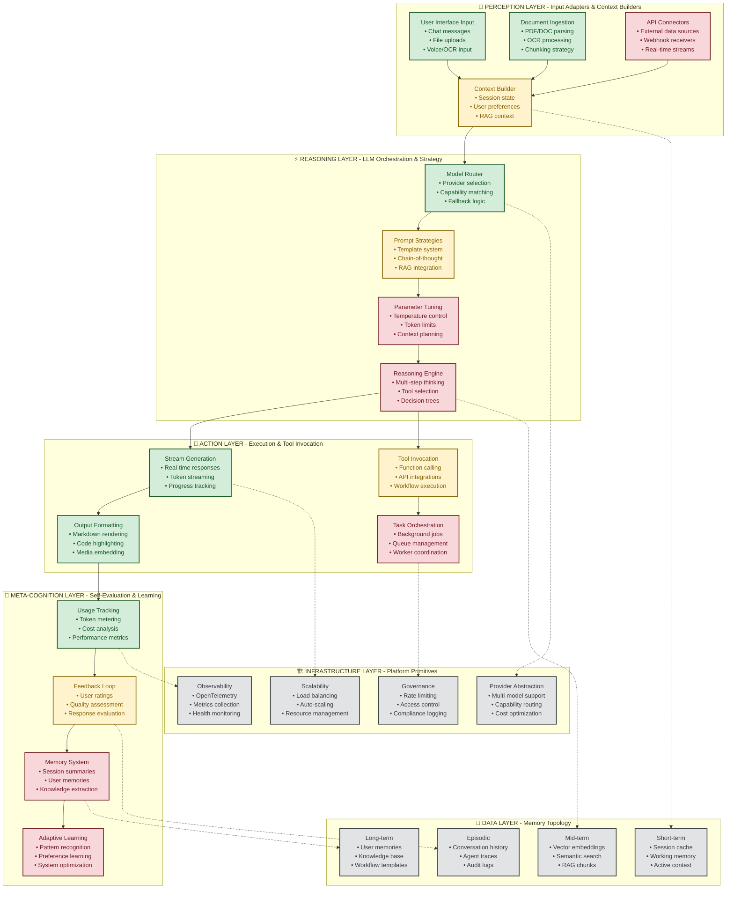

1. Provider Abstraction Nuance

```mermaid
graph TB
  %% ========= COGNITIVE FLOW: PERCEPTION → REASONING → ACTION → META-COGNITION =========
  
  subgraph PERCEPTION["🧠 PERCEPTION LAYER - Input Adapters & Context Builders"]
    direction TB
    UI_INPUT["User Interface Input<br/>• Chat messages<br/>• File uploads<br/>• Voice/OCR input"]
    DOC_INGEST["Document Ingestion<br/>• PDF/DOC parsing<br/>• OCR processing<br/>• Chunking strategy"]
    API_CONN["API Connectors<br/>• External data sources<br/>• Webhook receivers<br/>• Real-time streams"]
    CONTEXT_BUILD["Context Builder<br/>• Session state<br/>• User preferences<br/>• RAG context"]
  end

  subgraph REASONING["⚡ REASONING LAYER - LLM Orchestration & Strategy"]
    direction TB
    MODEL_ROUTER["Model Router<br/>• Provider selection<br/>• Capability matching<br/>• Fallback logic"]
    PROMPT_STRAT["Prompt Strategies<br/>• Template system<br/>• Chain-of-thought<br/>• RAG integration"]
    PARAM_TUNE["Parameter Tuning<br/>• Temperature control<br/>• Token limits<br/>• Context planning"]
    REASONING_ENGINE["Reasoning Engine<br/>• Multi-step thinking<br/>• Tool selection<br/>• Decision trees"]
  end

  subgraph ACTION["🎯 ACTION LAYER - Execution & Tool Invocation"]
    direction TB
    STREAM_GEN["Stream Generation<br/>• Real-time responses<br/>• Token streaming<br/>• Progress tracking"]
    TOOL_CALL["Tool Invocation<br/>• Function calling<br/>• API integrations<br/>• Workflow execution"]
    TASK_QUEUE["Task Orchestration<br/>• Background jobs<br/>• Queue management<br/>• Worker coordination"]
    OUTPUT_FORMAT["Output Formatting<br/>• Markdown rendering<br/>• Code highlighting<br/>• Media embedding"]
  end

  subgraph META_COGNITION["🔄 META-COGNITION LAYER - Self-Evaluation & Learning"]
    direction TB
    USAGE_TRACK["Usage Tracking<br/>• Token metering<br/>• Cost analysis<br/>• Performance metrics"]
    FEEDBACK_LOOP["Feedback Loop<br/>• User ratings<br/>• Quality assessment<br/>• Response evaluation"]
    MEMORY_SYS["Memory System<br/>• Session summaries<br/>• User memories<br/>• Knowledge extraction"]
    ADAPTIVE_LEARN["Adaptive Learning<br/>• Pattern recognition<br/>• Preference learning<br/>• System optimization"]
  end

  %% ========= DATA & INFRASTRUCTURE LAYERS =========
  
  subgraph DATA_LAYER["💾 DATA LAYER - Memory Topology"]
    direction LR
    SHORT_TERM["Short-term<br/>• Session cache<br/>• Working memory<br/>• Active context"]
    MID_TERM["Mid-term<br/>• Vector embeddings<br/>• Semantic search<br/>• RAG chunks"]
    LONG_TERM["Long-term<br/>• User memories<br/>• Knowledge base<br/>• Workflow templates"]
    EPISODIC["Episodic<br/>• Conversation history<br/>• Agent traces<br/>• Audit logs"]
  end

  subgraph INFRASTRUCTURE["🏗️ INFRASTRUCTURE LAYER - Platform Primitives"]
    direction LR
    PROVIDER_ABS["Provider Abstraction<br/>• Multi-model support<br/>• Capability routing<br/>• Cost optimization"]
    OBSERVABILITY["Observability<br/>• OpenTelemetry<br/>• Metrics collection<br/>• Health monitoring"]
    GOVERNANCE["Governance<br/>• Rate limiting<br/>• Access control<br/>• Compliance logging"]
    SCALABILITY["Scalability<br/>• Load balancing<br/>• Auto-scaling<br/>• Resource management"]
  end

  %% ========= COGNITIVE FLOW CONNECTIONS =========
  UI_INPUT --> CONTEXT_BUILD
  DOC_INGEST --> CONTEXT_BUILD
  API_CONN --> CONTEXT_BUILD
  
  CONTEXT_BUILD --> MODEL_ROUTER
  MODEL_ROUTER --> PROMPT_STRAT
  PROMPT_STRAT --> PARAM_TUNE
  PARAM_TUNE --> REASONING_ENGINE
  
  REASONING_ENGINE --> STREAM_GEN
  REASONING_ENGINE --> TOOL_CALL
  TOOL_CALL --> TASK_QUEUE
  STREAM_GEN --> OUTPUT_FORMAT
  
  OUTPUT_FORMAT --> USAGE_TRACK
  USAGE_TRACK --> FEEDBACK_LOOP
  FEEDBACK_LOOP --> MEMORY_SYS
  MEMORY_SYS --> ADAPTIVE_LEARN
  
  %% ========= DATA FLOW CONNECTIONS =========
  CONTEXT_BUILD -.-> SHORT_TERM
  REASONING_ENGINE -.-> MID_TERM
  MEMORY_SYS -.-> LONG_TERM
  FEEDBACK_LOOP -.-> EPISODIC
  
  %% ========= INFRASTRUCTURE SUPPORT =========
  MODEL_ROUTER -.-> PROVIDER_ABS
  USAGE_TRACK -.-> OBSERVABILITY
  TASK_QUEUE -.-> GOVERNANCE
  STREAM_GEN -.-> SCALABILITY

  %% ========= CURRENT IMPLEMENTATION STATUS =========
  classDef implemented fill:#d4edda,stroke:#155724,color:#155724,stroke-width:2px
  classDef partial fill:#fff3cd,stroke:#856404,color:#856404,stroke-width:2px
  classDef planned fill:#f8d7da,stroke:#721c24,color:#721c24,stroke-width:2px
  classDef infrastructure fill:#e2e3e5,stroke:#383d41,color:#383d41,stroke-width:2px

  %% Current Implementation Status
  class UI_INPUT,DOC_INGEST,MODEL_ROUTER,STREAM_GEN,OUTPUT_FORMAT,USAGE_TRACK implemented
  class CONTEXT_BUILD,PROMPT_STRAT,TOOL_CALL,FEEDBACK_LOOP partial
  class API_CONN,PARAM_TUNE,REASONING_ENGINE,TASK_QUEUE,MEMORY_SYS,ADAPTIVE_LEARN planned
  class SHORT_TERM,MID_TERM,LONG_TERM,EPISODIC,PROVIDER_ABS,OBSERVABILITY,GOVERNANCE,SCALABILITY infrastructure

```
